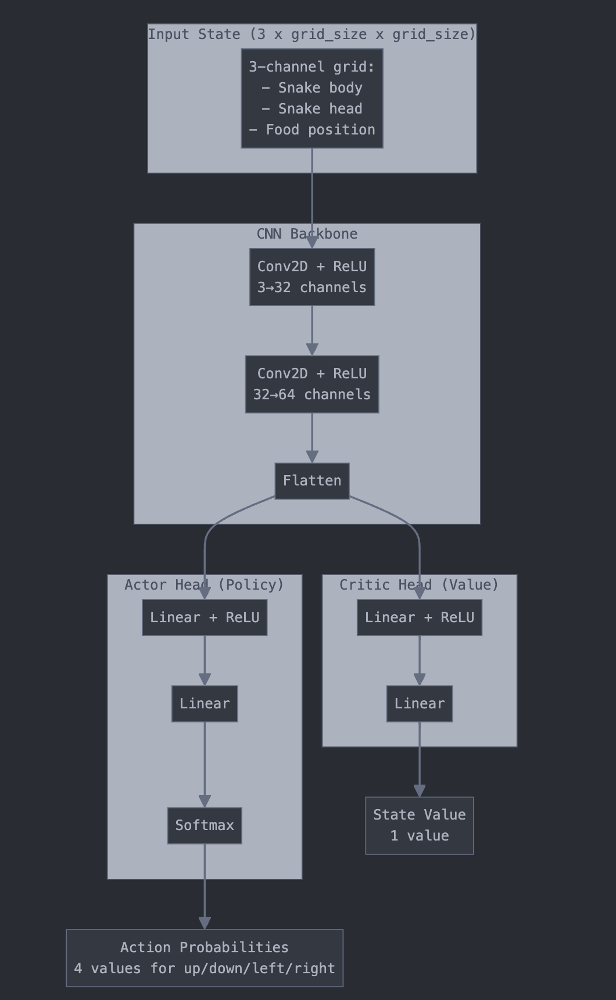

# Implementing PPO from scratch for Snake

This repo contains an implementation of a Snake RL Agent with PPO (coded up the algorithm from scratch). I tried to implement this exactly according to the [original paper](https://arxiv.org/abs/1707.06347). 

I mainly did this just so I can get a better understanding of how PPO works at a technical level. Nothing super groundbreaking in this repo but it may be a good resource for someone looking to implement PPO from scratch.

If you wanna talk about RL/collab on a project, reach out to me on [X](https://x.com/aidanwiteck). 

## Usage

Main training script is in `tests/test_ppo.py`. This initializes the environment, the PPO agent, and runs the training loop and one testing episode (which is visualized in the console).

```bash
python tests/test_ppo.py
```

## Setup

First create and activate a virtual environment:

```bash
python -m venv .venv
source .venv/bin/activate
```

Then install the dependencies:

```bash
pip install -r requirements.txt
```

From there you can run the training script as shown above.

## Environment
See `src/environments/single_agent.py` for the implementation.

Pretty simple environment for this. The state is represented by a binary tensor of shape `3 x grid_size x grid_size`, where the first channel is the snake's body (1 if body), the second is the snake's head (1 if head), and the third is the food (1 if food). The agent can take 4 actions: up, down, left, right.

The reward function is pretty simple:

- `+5.0` if it eats food
- `-1.0` for colliding with the wall or itself
- `0` otherwise (i.e. a normal step with no collision or food). 

This reward function worked okay -- after 100 iterations of training, the snake consistently gets the first bit of food, but doesn't know what to do after that. I'll probably rent an A100 or something for my next project and actually train this for at least O(1000) iterations.


## Networks

Actor-critic network architecture is shown in the following figure:



See `src/networks/actor_critic.py` for the implementation.

The CNN embeds the state, which is then processed by both the actor and critic networks (I used super simple MLPs for these networks since I trained on my own machine...).

## Training

Training is done in `src/algorithms/ppo.py`. You can mess with some of the hyperparams in `configs/default.yaml`, or just modify them in the training script.

## Next steps

I'm going to leave this current repo as is. 


I'm probably going to work on a multi-agent environment of this next, but for that I plan on using a framework rather than coding it up from scratch. 

